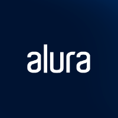
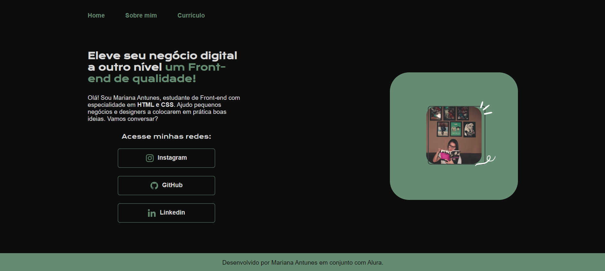

# 

<a href="https://marianayaqi.github.io/landingpageonebitcode/">

  
  

</a>

<h1 align="center"> Projeto Portifólio Alura</h1>

Apenas com HTML e CSS e FIGMA 
 
Criado junto ao time da  Alura 👩‍💻

 

  <a href="#-tecnologias">Tecnologias</a>&nbsp;&nbsp;&nbsp;|&nbsp;&nbsp;&nbsp;
  <a href="#-projeto">Projeto</a>&nbsp;&nbsp;&nbsp;|&nbsp;&nbsp;&nbsp;
  <a href="#-layout">Layout</a>&nbsp;&nbsp;&nbsp;|&nbsp;&nbsp;&nbsp;
  <a href="#memo-licença">Licença</a>

  
 

## 🎨 Layout

<h2 align="center">Versão desktop<h2>
 

  

 

## 💻 Projeto

<a target="_blank" href="http://127.0.0.1:5500/index.html">Clique aqui</a> para conferir o resultado final.

 
<h3>
  🕹️ Este projeto foi desenvolvido por Guilherme e Rafaela Balerine, do canal <a target="_blank" href="https://www.youtube.com/@Alura">"Canal Alura".</a>
   

 

## 🤓 Tecnologias

Esse projeto foi desenvolvido com as seguintes tecnologias:

<li> HTML
<li> CSS
<li> FIGMA
<li> Git and GitHub

 
  

## :memo: Licença

Esse projeto está sob a licença MIT.

---

     
<h4> Obrigado por visitar meu Git e se chegou até aqui dê um "FOLLOW" que retribuo, quem sabe não podemos colaborar em algum projeto juntos?
   
  

 Até a próxima! - Bye 😉
